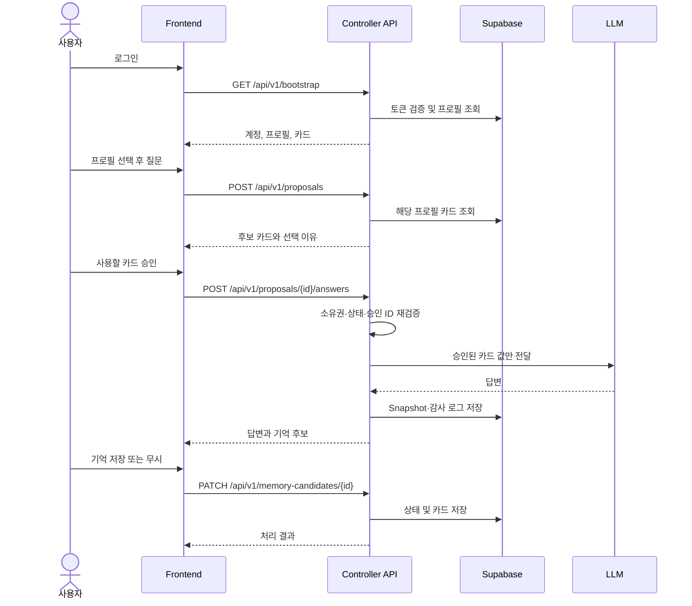
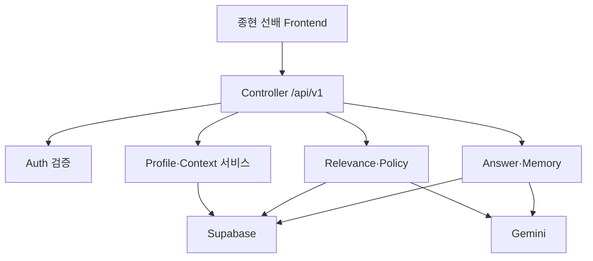

# Context Bridge 프론트엔드–백엔드 통합 계약서

> 기준 코드: `context-bridge-v12-hermetic-tests(1).zip`  
> 문서 목적: 종현 선배의 UI/UX와 사용자 흐름을 유지하면서, 도원님의 기존 백엔드 기능을 Controller API로 연결하기 위한 단일 계약서  
> 작성일: 2026-07-29

---

## 1. 결론

역할은 다음처럼 나누는 것이 가장 안전하다.

| 담당 | 소유 범위 |
|---|---|
| 종현 선배 / `frontend` 브랜치 | 화면, 컴포넌트, 접근성, 라우팅, 로딩·오류 표시, 클라이언트 상태 |
| 도원 / `backend` 브랜치 | 인증 검증, Controller API, DB, 맥락 선별, 승인 검증, LLM 호출, 감사 로그 |
| 공동 계약 | API URL, HTTP method, 요청·응답 JSON, TypeScript 타입, 오류 코드, 인증 방식 |
| 통합 브랜치 | `develop` |
| 배포 기준 브랜치 | 검증이 끝난 `main` |

프론트는 백엔드의 내부 함수나 DB 테이블을 직접 사용하지 않는다. 프론트가 의존할 대상은 오직 다음 세 가지다.

1. API 명세
2. 공유 TypeScript 타입
3. API 호출 함수

현재 v12의 `src/types.ts`와 `src/services/api.ts`를 출발점으로 삼되, 이 문서의 수정 계약으로 통일한다.

---

## 2. 최종 사용자 흐름



### 화면과 API 연결

| 종현 선배 화면 | 사용자 행동 | 호출 API | 성공 후 UI 상태 |
|---|---|---|---|
| 로그인 | 로그인 완료 | Supabase Auth 후 `GET /bootstrap` | 프로필 선택 화면 |
| 프로필 선택 | 프로필 카드 선택 | 추가 호출 없음 | 질문 또는 프로필 상세 |
| 프로필 관리 | 프로필 생성 | `POST /profiles` | 새 프로필 활성화 |
| 맥락 카드 관리 | 카드 추가·수정·삭제 | 카드 CRUD API | 해당 프로필 카드 목록 갱신 |
| 질문 | 질문 전송 | `POST /proposals` | 승인 모달 |
| 승인 모달 | 사용할 카드 확인 | `POST /proposals/{id}/answers` | 답변 화면 |
| 답변 | 기억 후보 저장·무시 | `PATCH /memory-candidates/{id}` | 후보 처리 완료 표시 |
| 히스토리 | 진입·더보기 | `GET /audit-logs` | 감사 기록 목록 |

---

## 3. Controller 서버의 책임

Controller는 프론트와 기존 서비스 로직 사이의 유일한 입구다.



Controller가 반드시 수행할 일:

- Bearer access token 검증
- 요청 body·path·query 검증
- 로그인 사용자와 `profileId`, `proposalId`, `contextId`의 소유권 검증
- HTTP DTO와 내부 Domain 객체 변환
- 서비스 함수 호출
- 일관된 성공 응답과 오류 응답 생성
- 승인되지 않은 카드 값이 LLM에 전달되지 않도록 차단
- Proposal 상태 전이와 중복 요청 통제
- 감사 로그 및 승인 Snapshot 저장

Controller가 하면 안 되는 일:

- React UI 상태 관리
- 프론트가 보내온 카드 전체 객체를 신뢰
- 클라이언트에서 받은 `userId`로 소유자 결정
- 브라우저에 Gemini key 또는 service role key 노출
- DB row 이름인 `value_text`, `sensitivity`를 프론트에 그대로 노출

---

## 4. 공통 API 규약

### 4.1 Base URL

| 환경 | 값 |
|---|---|
| 로컬 통합 | `http://localhost:3000/api/v1` |
| 동일 도메인 배포 | `/api/v1` |
| 프론트·백엔드 분리 배포 | `VITE_API_BASE_URL + /api/v1` |

프론트 코드에 `localhost`, Vercel URL 또는 Supabase URL을 직접 하드코딩하지 않는다.

### 4.2 인증

모든 보호 API는 다음 헤더를 사용한다.

```http
Authorization: Bearer <SUPABASE_ACCESS_TOKEN>
Content-Type: application/json
Accept: application/json
X-Request-Id: <UUID, 선택>
```

- 프론트는 Supabase 로그인 결과의 `session.access_token`만 Controller에 전달한다.
- 프론트가 `userId`, 이메일 또는 role을 body로 보내 인증을 대신하면 안 된다.
- Controller가 Supabase Auth로 토큰을 검증한 뒤 `user.id`를 결정한다.
- `SUPABASE_SERVICE_ROLE_KEY`와 `GEMINI_API_KEY`는 서버 환경변수에만 둔다.

### 4.3 JSON 이름 규칙

- API JSON: `camelCase`
- TypeScript: `camelCase`
- Supabase DB: `snake_case`
- DB ↔ API 변환은 백엔드 `mapper`에서만 수행
- 날짜: UTC ISO 8601 문자열, 예: `2026-07-29T04:20:31.000Z`
- ID: UUID 문자열로 통일
- 선택값: enum 문자열 사용
- 값이 없는 선택 필드는 생략하며, 의미 없이 `null`을 섞지 않는다.

### 4.4 성공 응답

단일 객체:

```json
{
  "data": {
    "id": "550e8400-e29b-41d4-a716-446655440000"
  },
  "meta": {
    "requestId": "c96e697e-ddf8-469e-9db1-645d939282fe"
  }
}
```

목록:

```json
{
  "data": [],
  "meta": {
    "requestId": "c96e697e-ddf8-469e-9db1-645d939282fe",
    "nextCursor": null
  }
}
```

삭제 성공: `204 No Content`

> 현재 v12는 `{ profile: ... }`, `{ context: ... }`처럼 API마다 최상위 키가 다르다. 통합 시 위의 `{ data, meta }`로 통일하는 것을 권장한다. 프론트와 일정상 즉시 변경하기 어렵다면 v12 형식을 유지하되, 중간에 형식을 바꾸지 말고 API v2에서 변경한다.

### 4.5 오류 응답

```json
{
  "error": {
    "code": "PROFILE_NOT_FOUND",
    "message": "프로필을 찾을 수 없습니다.",
    "fieldErrors": {
      "profileId": "존재하지 않거나 접근할 수 없는 프로필입니다."
    },
    "retryable": false
  },
  "meta": {
    "requestId": "c96e697e-ddf8-469e-9db1-645d939282fe"
  }
}
```

| HTTP | 사용 조건 | 대표 error code |
|---:|---|---|
| 400 | JSON 형식·비즈니스 입력 오류 | `INVALID_REQUEST` |
| 401 | 토큰 없음·만료·위조 | `AUTH_REQUIRED`, `TOKEN_EXPIRED` |
| 403 | 로그인했지만 권한 없음 | `FORBIDDEN`, `CONTEXT_RESTRICTED` |
| 404 | 리소스 없음 또는 소유자가 아님 | `PROFILE_NOT_FOUND`, `PROPOSAL_NOT_FOUND` |
| 409 | 상태 충돌·중복 처리 | `PROPOSAL_ALREADY_PROCESSED`, `DUPLICATE_PROFILE_NAME` |
| 422 | 필드 검증 실패 | `VALIDATION_ERROR` |
| 429 | 요청 제한 | `RATE_LIMITED` |
| 500 | 예측하지 못한 서버 오류 | `INTERNAL_ERROR` |
| 502 | 외부 AI·DB 의존성 실패 | `LLM_UNAVAILABLE`, `DATABASE_UNAVAILABLE` |
| 503 | 일시적 서비스 불가 | `SERVICE_UNAVAILABLE` |

프론트는 `message` 문자열을 분기 조건으로 사용하지 않고 `error.code`로 처리한다.

---

## 5. 프론트에 전달할 공통 TypeScript 타입

백엔드 저장소의 `packages/contracts/src/index.ts` 또는 공동 저장소의 `src/contracts/index.ts`에 두고 양쪽이 같은 파일을 사용한다.

```ts
export type UUID = string;
export type ISODateTime = string;

export type ContextCategory =
  | 'profile'
  | 'preference'
  | 'goal'
  | 'constraint'
  | 'project';

export type PrivacyLevel = 'normal' | 'sensitive' | 'confidential';
export type PersonaType = 'university_student' | 'older_adult' | 'custom';
export type ExclusionReason = 'UNRELATED' | 'DISABLED' | 'RESTRICTED';
export type ProposalState =
  | 'AWAITING_APPROVAL'
  | 'APPROVED'
  | 'ANSWERED'
  | 'FAILED';
export type MemoryCandidateStatus = 'PENDING' | 'SAVED' | 'IGNORED';
export type SelectionMode = 'rules' | 'llm';

export interface ContextItem {
  id: UUID;
  title: string;
  category: ContextCategory;
  content: string;
  tags: string[];
  isActive: boolean;
  privacyLevel: PrivacyLevel;
  updatedAt: ISODateTime;
}

export interface ContextProfile {
  id: UUID;
  displayName: string;
  personaType: PersonaType;
  name: string;
  icon: string;
  description: string;
  contexts: ContextItem[];
}

export interface EvaluatedContext {
  contextId: UUID;
  context: ContextItem;
  relevanceScore: number; // 0~100
  reason: string;
  suggested: boolean;
  approvedByUser: boolean;
  isStale: boolean;
  exclusionReason?: ExclusionReason;
  valueVisible: boolean;
}

export interface MemoryCandidate {
  id: UUID;
  label: string;
  category: ContextCategory;
  content: string;
  privacyLevel: PrivacyLevel;
  status: MemoryCandidateStatus;
}

export interface QueryAuditLog {
  id: UUID;
  timestamp: ISODateTime;
  userQuery: string;
  evaluations: EvaluatedContext[];
  contextBridgeAnswer: string;
  rawAnswer?: string;
  totalVaultCount: number;
  usedContextCount: number;
  privacySavedCount: number;
  snapshotHash: string;
  profileId: UUID;
  usedContexts: ContextItem[];
}

export interface ApiSuccess<T> {
  data: T;
  meta: {
    requestId: UUID;
    nextCursor?: string | null;
  };
}

export interface ApiError {
  error: {
    code: string;
    message: string;
    fieldErrors?: Record<string, string>;
    retryable: boolean;
  };
  meta: {
    requestId: UUID;
  };
}
```

### 생성·수정 DTO를 Entity와 분리

프론트는 새 카드의 `id`, `updatedAt`, 소유자 정보를 만들지 않는다.

```ts
export interface CreateProfileRequest {
  name: string;
  icon: string;
  description: string;
}

export interface UpdateProfileRequest {
  name?: string;
  icon?: string;
  description?: string;
}

export interface CreateContextRequest {
  title: string;
  category: ContextCategory;
  content: string;
  tags: string[];
  isActive?: boolean;
  privacyLevel: PrivacyLevel;
}

export interface UpdateContextRequest {
  title?: string;
  category?: ContextCategory;
  content?: string;
  tags?: string[];
  isActive?: boolean;
  privacyLevel?: PrivacyLevel;
}
```

---

## 6. API 상세 계약

### 6.1 초기 데이터

#### `GET /api/v1/bootstrap`

로그인 직후 한 번 호출한다.

응답 data:

```ts
interface BootstrapResponse {
  user: {
    id: UUID;
    email: string;
  };
  profiles: ContextProfile[];
  mode: 'supabase' | 'local-demo';
}
```

정책:

- 첫 번째 프로필을 무조건 선택하기보다 마지막 선택 프로필 ID를 별도 설정으로 저장하거나 사용자가 선택하게 한다.
- 감사 로그는 bootstrap에서 분리한다. 기록이 늘면 초기 로딩이 무거워지기 때문이다.
- 프로필이 0개면 프론트는 온보딩·프로필 생성 화면을 표시한다.

---

### 6.2 프로필

#### `POST /api/v1/profiles`

요청:

```json
{
  "name": "학교생활",
  "icon": "🎓",
  "description": "수업과 취업 준비용"
}
```

성공: `201`, `ApiSuccess<ContextProfile>`

#### `PATCH /api/v1/profiles/{profileId}`

요청: `UpdateProfileRequest`  
성공: `200`, `ApiSuccess<ContextProfile>`

#### `DELETE /api/v1/profiles/{profileId}`

성공: `204`

정책:

- 프로필 삭제 시 소속 카드도 DB FK cascade로 삭제된다.
- 삭제 전 프론트가 확인창을 표시한다.
- 마지막 프로필 삭제를 허용할지 팀이 결정해야 한다. 권장값은 허용 후 온보딩으로 이동이다.

> v12에는 프로필 생성만 있고 수정·삭제 API가 없다. 종현 선배 흐름에 프로필 수정 화면이 있다면 위 두 API가 반드시 필요하다.

---

### 6.3 맥락 카드

#### `POST /api/v1/profiles/{profileId}/contexts`

요청: `CreateContextRequest`  
성공: `201`, `ApiSuccess<ContextItem>`

서버가 생성할 값:

- `id`
- `updatedAt`
- `userId`
- `profileId`

#### `PATCH /api/v1/profiles/{profileId}/contexts/{contextId}`

요청: `UpdateContextRequest`  
성공: `200`, `ApiSuccess<ContextItem>`

#### `DELETE /api/v1/profiles/{profileId}/contexts/{contextId}`

성공: `204`

#### 선택 API: `GET /api/v1/profiles/{profileId}/contexts`

프로필별 카드만 다시 불러올 때 사용한다. `ApiSuccess<ContextItem[]>`

정책:

- 생성과 수정을 하나의 `POST upsert`로 합치지 않는다.
- `confidential` 카드는 일반 후보 API에서 실제 `content`를 노출하지 않는다.
- `tags`는 0~10개, 각 1~30자로 제한한다.
- `title` 1~50자, `content` 1~1,000자 권장.
- `category`와 `privacyLevel`은 enum 외 값을 거절한다.

---

### 6.4 질문 분석 및 승인 후보 생성

#### `POST /api/v1/proposals`

요청:

```ts
interface CreateProposalRequest {
  profileId: UUID;
  query: string;
}
```

예:

```json
{
  "profileId": "550e8400-e29b-41d4-a716-446655440000",
  "query": "친구와 갈 만한 조용한 식당을 추천해줘"
}
```

응답 data:

```ts
interface CreateProposalResponse {
  proposalId: UUID;
  state: 'AWAITING_APPROVAL';
  query: string;
  evaluations: EvaluatedContext[];
  selectionMode: SelectionMode;
  summaryReasoning: string;
  expiresAt: ISODateTime;
}
```

핵심 보안 규칙:

- 이 단계에서 LLM 관련성 판정을 사용하더라도 카드의 `title`, `category`, `tags`만 보낸다.
- `confidential` 카드의 값은 응답과 외부 AI 모두에서 차단한다.
- 프론트는 `suggested: true` 카드만 기본 체크한다.
- `isStale: true` 또는 `privacyLevel: sensitive` 카드는 기본 해제하는 UI 정책을 권장한다.
- `RESTRICTED` 카드는 체크박스를 비활성화한다.

---

### 6.5 승인 후 답변 생성

#### `POST /api/v1/proposals/{proposalId}/answers`

요청:

```ts
interface GenerateAnswerRequest {
  approvedContextIds: UUID[];
  includeRawComparison?: boolean;
  temporaryNote?: string;
  idempotencyKey: UUID;
}
```

예:

```json
{
  "approvedContextIds": [
    "6ec74bf6-a91a-4d0f-ae06-af8f21618a93"
  ],
  "includeRawComparison": true,
  "temporaryNote": "오늘은 버스를 이용할 예정",
  "idempotencyKey": "da683e5a-d5da-4d71-b81a-56fc5dfc2fa9"
}
```

응답 data:

```ts
interface GenerateAnswerResponse {
  proposalId: UUID;
  state: 'ANSWERED';
  contextBridgeAnswer: string;
  rawAnswer?: string;
  usedContexts: ContextItem[];
  usedContextCount: number;
  snapshotHash: string;
  memoryCandidates: MemoryCandidate[];
  auditLog: QueryAuditLog;
}
```

절대 규칙:

- 프론트는 `approvedContextIds`만 보낸다. 승인 카드 객체나 `content`를 다시 보내지 않는다.
- Controller는 Proposal 생성 시점의 서버 Snapshot에서 ID를 다시 찾는다.
- 다른 프로필 카드, 비활성 카드, 기밀 카드, 존재하지 않는 ID가 하나라도 있으면 거절한다.
- 같은 `idempotencyKey`의 재요청은 답변을 중복 생성·과금하지 않고 기존 결과를 돌려준다.
- 처리 완료 Proposal을 다시 승인하면 `409 PROPOSAL_ALREADY_PROCESSED`.
- `temporaryNote`는 현재 질문에만 쓰고 DB 카드로 자동 저장하지 않는다.

> 현재 v12 경로는 `/generate`, 요청 키는 `approvedIds`, `tempNote`다. 합치기 전에 위 이름으로 바꾸거나, 프론트가 기존 이름을 쓸지 한 번 확정해야 한다. 권장 최종 이름은 의미가 더 분명한 `answers`, `approvedContextIds`, `temporaryNote`다.

---

### 6.6 기억 후보 처리

#### `PATCH /api/v1/memory-candidates/{candidateId}`

요청:

```ts
interface ResolveMemoryCandidateRequest {
  action: 'save' | 'ignore';
}
```

응답 data:

```ts
interface ResolveMemoryCandidateResponse {
  candidateId: UUID;
  status: 'SAVED' | 'IGNORED';
  profileId: UUID;
  context?: ContextItem;
}
```

정책:

- 자동 저장하지 않는다.
- `save`일 때만 카드 생성.
- 이미 처리된 후보를 다시 처리하면 `409 MEMORY_ALREADY_RESOLVED`.
- 후보가 속한 사용자와 프로필을 서버에서 확인한다.

---

### 6.7 감사 로그

#### `GET /api/v1/audit-logs?profileId={id}&cursor={cursor}&limit=20`

응답: `ApiSuccess<QueryAuditLog[]>`

정책:

- 기본 최신순
- `limit` 기본 20, 최대 50
- profileId 생략 시 전체 프로필 기록
- 전체 `evaluations`가 DB에 없다면 빈 배열로 속이지 말고 필드를 선택형으로 바꾸거나 DB에 저장한다.

---

### 6.8 운영 보조

#### `GET /api/v1/health`

인증 없이 서버 생존만 확인:

```json
{
  "status": "ok",
  "version": "1.0.0"
}
```

#### `GET /api/v1/ready`

DB 등 핵심 의존성 준비 상태를 검사한다. 외부에 상세 secret이나 DB 오류 원문은 노출하지 않는다.

---

## 7. 프론트에 실제로 전달해야 하는 파일

최소 전달 세트:

```text
contracts/
├─ API_CONTRACT.md
├─ types.ts
├─ api-client.ts
├─ error-codes.ts
├─ mocks/
│  ├─ bootstrap.success.json
│  ├─ proposal.success.json
│  ├─ answer.success.json
│  └─ error.examples.json
├─ openapi.yaml
└─ .env.frontend.example
```

| 파일 | 내용 | 소유자 |
|---|---|---|
| `API_CONTRACT.md` | 이 문서의 확정 API 부분 | 공동, 변경은 PR 합의 |
| `types.ts` | 요청·응답·enum·Entity 타입 | 백엔드 초안, 공동 승인 |
| `api-client.ts` | fetch wrapper와 API 함수 | 프론트 |
| `error-codes.ts` | 오류 code 상수와 화면 처리 기준 | 백엔드 |
| `mocks/*.json` | 백엔드 없이 UI 개발 가능한 샘플 | 백엔드 |
| `openapi.yaml` | 기계 판독 가능한 API 명세 | 백엔드 |
| `.env.frontend.example` | `VITE_API_BASE_URL` 등 공개 설정 | 공동 |

절대 전달하면 안 되는 파일:

- 실제 `.env`
- `GEMINI_API_KEY`
- `SUPABASE_SERVICE_ROLE_KEY`
- 실제 사용자 토큰
- 운영 DB dump
- 개인 데이터가 들어간 로그

---

## 8. 프론트 API Client 기준

```ts
const API_BASE_URL =
  import.meta.env.VITE_API_BASE_URL ?? '';

let getAccessToken: () => Promise<string | null>;

export function configureApiClient(
  tokenProvider: () => Promise<string | null>,
) {
  getAccessToken = tokenProvider;
}

export async function apiRequest<T>(
  path: string,
  init: RequestInit = {},
): Promise<T> {
  const token = await getAccessToken();
  const response = await fetch(`${API_BASE_URL}/api/v1${path}`, {
    ...init,
    headers: {
      Accept: 'application/json',
      ...(init.body ? { 'Content-Type': 'application/json' } : {}),
      ...(token ? { Authorization: `Bearer ${token}` } : {}),
      ...init.headers,
    },
  });

  if (response.status === 204) return undefined as T;

  const body = await response.json();
  if (!response.ok) {
    throw new ApiClientError(
      body.error.code,
      body.error.message,
      response.status,
      body.error.retryable,
      body.error.fieldErrors,
    );
  }
  return body.data as T;
}
```

프론트 구현 규칙:

- 토큰을 모듈 전역 문자열에 장기간 복사해두기보다 현재 Supabase session에서 가져온다.
- `401`이면 세션 갱신 1회 후 재시도하고, 또 실패하면 로그인 화면으로 이동한다.
- GET만 제한적으로 재시도한다.
- 답변 생성 POST 재시도는 반드시 `idempotencyKey`와 함께 한다.
- 컴포넌트에서 직접 `fetch`하지 않고 `api-client.ts` 함수만 사용한다.
- UI 컴포넌트는 DB 이름을 알지 못해야 한다.

---

## 9. 현재 v12 코드에서 발견된 통합 차단 이슈

### P0: 합치기 전에 반드시 해결

| 문제 | 현재 코드 | 영향 | 수정 |
|---|---|---|---|
| 카드 ID 형식 충돌 | 프론트가 `ctx-${Date.now()}`, 기억 저장이 `ctx-${UUID}` 생성 | Supabase `uuid` 컬럼 저장 실패 | 생성 ID는 서버가 순수 UUID로 생성 |
| Proposal 메모리 저장 | `ProposalStore`가 서버 process 메모리에 존재 | 재시작·다중 인스턴스·Vercel serverless에서 proposal 유실 | Proposal과 승인 대상 Snapshot을 DB에서 원자적으로 조회·갱신 |
| API 계약 불일치 | 서버는 `selectionMode`를 보내지만 `ContextAnalysisResponse` 타입에 없음 | 프론트 타입과 실응답 불일치 | 응답 타입에 `selectionMode` 추가 |
| 생성·수정 API 혼합 | 카드 저장이 POST upsert 한 개 | 생성/수정 권한·status·검증 불명확 | POST create, PATCH update 분리 |
| Proposal 상태 원자성 부족 | Snapshot·audit·proposal update가 개별 쿼리 | 중간 실패 시 데이터 불일치 | Supabase RPC 또는 DB transaction 함수로 묶기 |

### P1: 통합 테스트 전 해결

| 문제 | 영향 | 수정 |
|---|---|---|
| 오류 형식이 `{ error: string }` 하나 | 프론트가 오류 유형을 안정적으로 구분하지 못함 | 공통 `ApiError` 적용 |
| `/api/proposals`가 대부분 오류를 401로 반환 | DB 오류·입력 오류가 로그인 오류처럼 보임 | 오류 class별 status 매핑 |
| CORS가 전체 허용 | 운영 API를 임의 Origin에서 호출 가능 | 허용 frontend origin 목록 지정 |
| Body schema 검증 없음 | 잘못된 enum·길이·배열이 DB까지 전달 | Zod 등으로 Controller 입구 검증 |
| profile 수정·삭제 없음 | 종현 선배 사용자 흐름이 완성되지 않음 | PATCH·DELETE 추가 |
| audit가 bootstrap에 포함 | 초기 로딩이 기록 증가에 따라 느려짐 | 페이지네이션 API로 분리 |
| `displayName`이 이메일 앞부분으로 고정 | 실제 사용자 이름 관리 불가 | 사용자 설정 또는 프로필 입력으로 분리 |
| rate limit·timeout 없음 | AI 과금·중복 클릭·장시간 대기 위험 | 사용자별 제한, LLM timeout, 중복 클릭 방지 |

### P2: 배포 전 개선

- API version `/api/v1` 적용
- OpenAPI 생성 및 CI 검증
- request ID와 구조화 로그
- health/readiness endpoint
- idempotency key 저장
- Proposal 만료 시간 적용
- audit 로그의 `evaluations`, `totalVaultCount`, `privacySavedCount` 저장 여부 확정
- 개인정보 로그 마스킹
- 브라우저 E2E와 접근성 테스트

---

## 10. 권장 백엔드 폴더 구조

```text
backend/
├─ src/
│  ├─ app.ts
│  ├─ server.ts
│  ├─ controllers/
│  │  ├─ bootstrap.controller.ts
│  │  ├─ profiles.controller.ts
│  │  ├─ contexts.controller.ts
│  │  ├─ proposals.controller.ts
│  │  ├─ answers.controller.ts
│  │  ├─ memory.controller.ts
│  │  └─ audit.controller.ts
│  ├─ services/
│  │  ├─ profile.service.ts
│  │  ├─ context.service.ts
│  │  ├─ proposal.service.ts
│  │  ├─ relevance.service.ts
│  │  ├─ answer.service.ts
│  │  ├─ memory.service.ts
│  │  └─ audit.service.ts
│  ├─ repositories/
│  │  ├─ profile.repository.ts
│  │  ├─ context.repository.ts
│  │  ├─ proposal.repository.ts
│  │  └─ audit.repository.ts
│  ├─ middleware/
│  │  ├─ auth.ts
│  │  ├─ validate.ts
│  │  ├─ error-handler.ts
│  │  ├─ request-id.ts
│  │  └─ rate-limit.ts
│  ├─ mappers/
│  │  └─ context.mapper.ts
│  ├─ schemas/
│  │  ├─ profile.schema.ts
│  │  ├─ context.schema.ts
│  │  └─ proposal.schema.ts
│  ├─ contracts/
│  │  └─ index.ts
│  └─ config/
│     └─ env.ts
├─ tests/
│  ├─ contract/
│  ├─ integration/
│  └─ security/
├─ supabase/
│  └─ migrations/
├─ openapi.yaml
└─ .env.example
```

호출 방향은 `controller → service → repository` 단방향으로 유지한다. `repository`가 HTTP 응답 객체를 알거나, Controller가 Supabase 쿼리를 직접 작성하지 않게 한다.

---

## 11. Git 브랜치와 통합 방식

### 권장 브랜치

```text
main
└─ develop
   ├─ frontend
   │  └─ feature/frontend-profile-flow
   └─ backend
      └─ feature/backend-controller-api
```

이미 `frontend`, `backend` 두 브랜치만 사용하기로 했다면:

- 종현 선배: `frontend`
- 도원: `backend`
- 공동 통합: `develop`
- 발표·배포 검증 완료 후: `develop → main`

### 파일 충돌 방지

| 영역 | 수정 담당 |
|---|---|
| `src/components/**`, 스타일 | frontend |
| `src/pages/**`, UI 라우팅 | frontend |
| `backend/**` 또는 `src/server/**` | backend |
| `supabase/**` | backend |
| `contracts/**`, `openapi.yaml` | 공동 리뷰 |
| 루트 `package.json`, `.env.example` | 변경 전 서로 알림 |

현재처럼 `server.ts`와 React가 한 프로젝트에 있다면 첫 통합 전에 `frontend/`, `backend/`, `contracts/`로 물리적으로 분리하는 편이 충돌이 적다. 시간이 부족하면 구조 변경을 억지로 하지 말고, 최소한 소유 경로를 위 표처럼 확정한다.

### 통합 순서

1. `develop`을 현재 기준 코드로 확정한다.
2. `frontend`, `backend`를 같은 `develop` commit에서 만든다.
3. 백엔드가 먼저 `contracts/types.ts`, `openapi.yaml`, mock JSON을 올린다.
4. 프론트는 mock으로 종현 선배 UI 흐름을 완성한다.
5. 백엔드는 같은 contract에 맞춰 Controller API를 구현한다.
6. `backend → develop` PR을 먼저 또는 contract 단위로 병합한다.
7. `frontend`에서 API base URL만 실제 Controller로 바꾸고 통합 테스트한다.
8. `frontend → develop` 병합 후 E2E를 수행한다.
9. 기능 동결 후 `develop → main`.

### PR 완료 조건

- `npm run lint`
- `npm test -- --run`
- `npm run build`
- API contract test 통과
- 질문 → 후보 → 승인 → 답변 → 기억 저장 E2E 통과
- 다른 사용자 프로필 접근 차단 테스트 통과
- confidential 카드 값 미노출 테스트 통과
- 새 카드 생성이 실제 Supabase UUID로 성공
- 서버 재시작 후 진행 중 Proposal 처리 정책 검증

---

## 12. 프론트–백엔드 합의가 필요한 결정 8개

다음은 코드 작성 전에 두 사람이 한 번만 확정해야 한다.

1. 최종 API 이름을 v12 그대로 쓸지 `/api/v1` 규약으로 바꿀지
2. 프로필 선택을 매 로그인마다 보여줄지 마지막 선택을 기억할지
3. 프로필 0개·1개·여러 개일 때 각각 첫 화면
4. 민감 카드의 기본 체크 여부
5. 90일 이상 지난 카드의 경고 방식
6. 원본 비교 답변을 기본 생성할지 데모 전용으로 둘지
7. 답변 생성 timeout과 재시도 UI
8. 프로필 삭제 및 마지막 프로필 삭제 허용 여부

권장 기본값:

- `/api/v1` 사용
- 여러 프로필이면 선택 화면, 하나면 바로 진입하되 상단에서 변경 가능
- sensitive와 stale은 기본 해제
- raw 비교 답변은 데모 설정에서만 활성화
- 답변 timeout 30초, 자동 재시도 없음
- 프로필 삭제 허용, 0개가 되면 온보딩

---

## 13. 통합 테스트 시나리오

### 정상 흐름

1. 로그인 후 자신의 프로필만 보인다.
2. 프로필을 선택하고 질문한다.
3. 관련 카드가 선택 이유와 함께 나타난다.
4. 카드 일부만 승인한다.
5. 답변의 `usedContexts`가 승인 ID와 정확히 일치한다.
6. 질문에서 새 개인 정보가 발견되면 기억 후보가 나타난다.
7. `ignore`하면 카드가 생기지 않는다.
8. `save`하면 해당 프로필에 카드가 생긴다.
9. 새로고침 후에도 프로필·카드·감사 로그가 유지된다.

### 보안·실패 흐름

1. 토큰 없이 보호 API 호출 → `401`
2. A 사용자 토큰으로 B 프로필 조회 → `404` 또는 `403`
3. `confidential` 카드 승인 → `403`
4. 위조한 context ID 승인 → `400` 또는 `403`
5. 처리한 Proposal 재사용 → `409`
6. 서버 재시작 후 Proposal → DB 기반으로 정상 재개하거나 명확한 만료 오류
7. Gemini 장애 → `502 LLM_UNAVAILABLE`, 프론트 재시도 버튼
8. DB 장애 → `502 DATABASE_UNAVAILABLE`
9. 답변 버튼 연속 클릭 → 한 번만 생성
10. 잘못된 category → `422 VALIDATION_ERROR`

---

## 14. 도원님 백엔드 작업 순서

1. 공통 contract 타입과 API 이름 확정
2. 카드 ID 생성을 서버 UUID 방식으로 변경
3. Controller·service·repository 경계 분리
4. 요청 schema 검증과 공통 error handler 추가
5. 카드 POST/PATCH 분리
6. 프로필 PATCH/DELETE 추가
7. ProposalStore를 DB 기반 상태·Snapshot으로 교체
8. 승인과 감사 저장을 transaction/RPC로 묶기
9. audit pagination 분리
10. CORS, rate limit, timeout, idempotency 적용
11. OpenAPI와 mock JSON 전달
12. Supabase 라이브 환경에서 통합 E2E 수행

---

## 15. 종현 선배에게 바로 전달할 요약

> UI/UX와 화면 전환은 종현 선배 코드가 기준입니다. 백엔드는 화면에서 직접 Supabase 테이블이나 Gemini를 호출하지 않도록 Controller API를 제공합니다. 로그인 후 받은 Supabase access token을 Authorization Bearer로 보내면 됩니다. 프론트는 프로필·카드·후보·답변 타입과 API client만 사용하고, DB의 snake_case 이름은 알 필요가 없습니다. 질문 분석 때 `profileId + query`, 승인 후 답변 생성 때 `proposalId + approvedContextIds`만 보내며 카드 값은 다시 보내지 않습니다. 제가 `types.ts`, `openapi.yaml`, mock 응답, 오류 코드, `.env.frontend.example`을 먼저 전달하겠습니다. 프론트는 mock으로 UI를 완성하고, 이후 API base URL만 실제 Controller로 바꾸면 됩니다.

---

## 16. Definition of Done

아래가 모두 충족되면 프론트–백엔드 통합 완료다.

- 종현 선배 UI 흐름이 유지된다.
- 프론트에 백엔드·DB 비밀키가 없다.
- API 요청·응답이 공통 타입과 일치한다.
- 사용자별 프로필과 카드가 Supabase에 분리 저장된다.
- 질문 관련 카드만 후보로 표시된다.
- 사용자 승인 ID만 서버가 다시 검증한다.
- 승인된 카드 값만 LLM으로 전달된다.
- 기밀 카드 값은 UI와 LLM에 노출되지 않는다.
- 기억 후보는 동의 전 자동 저장되지 않는다.
- 감사 로그와 Snapshot이 재시작 후에도 유지된다.
- 중복 클릭·재요청으로 답변이 중복 생성되지 않는다.
- lint, unit, integration, E2E, build가 모두 통과한다.

