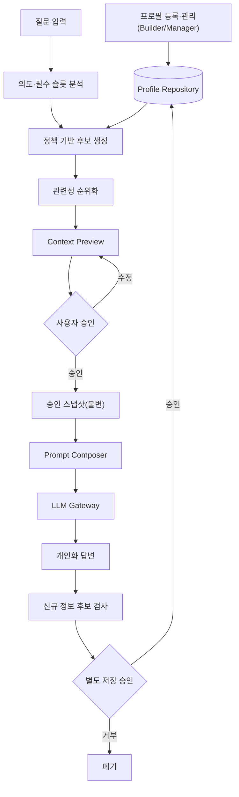

# Context Bridge 시스템 아키텍처 및 실행 계획 (v5)

> **제품 한 줄 정의:** 짧은 질문만 입력해도 저장된 개인 프로필에서 현재 질문에 필요한 맥락만 선별하고, 사용자가 확인·승인한 정보만으로 개인화 답변을 생성하는 사용자 통제형 AI 서비스.
>
> **v5 검수 요지:** v4 아키텍처·안전 설계는 옳다. 다만 ① **Profile CRUD(사용자 프로필 등록·관리)가 계획에서 사실상 실종**돼 제품 정체성의 절반이 0%로 남았고, ② `.claude/` 하네스가 제품 규모를 초과했다. v5는 Profile CRUD를 P0로 복원하고, 하네스를 적정화하며, 정직한 완성도 현황(§12)을 문서에 상주시킨다. 변경점은 각 절에 (신규)/(변경)으로 표기한다.

## 0. 문서 목적과 "프로필 선택" 3분할 (변경)

이 문서는 `초기기획안.txt`를 구현 가능한 시스템으로 재설계하고 실행 순서를 정의한다.

**"프로필 선택"을 하나로 부르면 구현 누락이 숨는다.** 실제로는 별개의 세 기능이며, 요구사항·단계·테스트에서 분리 관리한다.

| 기능 | 사용자 질문 | 담당 |
|---|---|---|
| ① 프로필 구축·관리 선택 | "나에 대해 무엇을 저장·수정·삭제할까?" | Profile Builder / Manager (§6 P0) |
| ② 질문별 맥락 선택 | "이번 질문에 어떤 프로필이 필요한가?" | Context Selector (§4) |
| ③ 신규 정보 저장 선택 | "대화에서 발견한 정보를 저장할까?" | Memory Candidate (§3.4, P1) |

**하네스 역할 분리:**

| 위치 | 역할 |
|---|---|
| `plan.md` (본 문서) | 제품·아키텍처·요구사항·단계·지표 |
| `CLAUDE.md` | 항상 적용되는 불변식·권한·명령 |
| `checklist.md` | 마일스톤 수용 게이트 |
| `specs/context-policy.yaml` (+schema) | 제품 정책 (에이전트 지침과 분리) |
| `.claude/` (rules·skills·hooks·agents) | **선택** — §5.4 적정화 규칙 적용 |

핵심 목표는 유지: (1) 질문에 필요한 최소 정보만 승인 후 사용, (2) 개발 순서 `Context → Plan → Permission → Tool → Verify → State` 강제.

---

## 1. 초기기획안 검수 결과

### 1.1 유지할 강점
- 질문별 `Context Selection`을 문제의 중심으로 잡음.
- `Context Preview`로 사용 정보를 사용자가 확인.
- 신규 정보 자동 저장 금지, 명시적 승인.
- 구조화 프로필·민감정보·신규 후보를 다르게 취급.
- 인지 부담 감소라는 포용적 가치.

### 1.2 주요 리스크와 개선 방향

| ID | 문제 | 개선 방향 | 상태 |
|---|---|---|---|
| R-01 | LLM이 선택·이유를 모두 자기 생성 → 순환 정당화 | 규칙으로 후보 제한, LLM은 순위화만, 이유는 `reason_code` | 유지 |
| R-02 | confidence 산출·보정 기준 없음 | 확률값 대신 필수 슬롯 충족으로 판단 | 유지 |
| R-03 | 승인→생성 데이터 동일성 보장 없음 | 불변 승인 스냅샷, Composer는 그것만 입력 | 유지 |
| R-04 | 민감정보 규칙 불명확 | 등급·목적 제한·매회 승인 코드화 | 유지 |
| R-05 | Session State가 업무 상태 중심 | 서버측 상태 머신 + DB 진실원천 | 유지 |
| R-06 | 항상 답변 2회 생성 | 비교는 데모/평가 모드로 제한 | 유지 |
| R-07~R-08 | ChromaDB·외부검색 조기 도입 | MVP는 구조화 프로필·외부검색 없는 시나리오 | 유지 |
| R-09 | 성능 지표 없음 | 골드셋 + 하드/진단 지표 분리 | 유지 |
| R-10 | 사용 기록의 개인정보화 | 최소 로그·보존기간·마스킹·삭제 | 유지 |
| R-11 | 신규 후보 즉시 추출 | 지속성·주체·명시성 통과분만 제안 | 유지 |
| R-12 | 접근성 기준 없음 | 제출 전 사용성 스모크 + 이후 정식 평가 | 유지 |
| R-13 | 매 질문 승인 피로 | MVP 매회 승인 유지, 클릭·시간 측정 후 검토 | 유지 |
| R-14 | 지원 밖 질문 억지 분류 | `unsupported` 상태 + 일반답변/재질문 경로 | 유지 |
| **R-15** | **"프로필 선택"에 프로필 CRUD가 뭉뚱그려져 계획에서 누락 → 사용자 프로필 관리 0%** | **§0 3분할, Profile Builder/Manager를 P0로, REQ-14~18 신설** | **신규** |
| **R-16** | **하네스(.claude 서브에이전트·Hook·skill)가 제품 규모 초과, P0 미완 상태에서 거버넌스 과투자** | **§5.4 적정화 — 최소 세트만 필수, 나머지 선택** | **신규** |

---

## 2. 요구사항 레지스터 (변경 — REQ-14~18 신설)

모든 커밋·작업은 아래 ID 중 하나 이상에 연결한다(G0 추적).

| ID | 요구사항 | 검증 |
|---|---|---|
| REQ-1 | 미승인 프로필 항목은 최종 프롬프트에 없다 | 통합·누출 |
| REQ-2 | LLM은 허용 후보 밖 정보를 생성/선택 못 한다 | 정책 |
| REQ-3 | 승인 스냅샷이 생성의 유일한 개인화 입력이다 | 스냅샷-프롬프트 일치 |
| REQ-4 | 저장된 `restricted`는 자동 조회·후보화되지 않는다 | 정책 |
| REQ-5 | 신규 정보는 승인 전 저장되지 않는다 | 상태전이 |
| REQ-6 | 전이는 중앙 상태머신을 통과, 금지 전이 차단 | 상태전이 |
| REQ-7 | 새로고침 후 상태가 DB 기준 복구된다 | 통합 |
| REQ-8 | 사용자가 각 컨텍스트 항목을 개별 승인·제외한다 | UI·통합 |
| REQ-9 | 로그에 전체 프로필·원시 프롬프트·민감값 기본 저장 안 함 | 보안 |
| REQ-10 | 지원 3개 의도에서 Context Precision 측정 | 골드셋 |
| REQ-11 | 지원 밖 질문을 임의 의도로 확정하지 않는다 | unsupported |
| REQ-12 | Preview는 키보드·명확 레이블·비색상 상태 제공 | 접근성 스모크 |
| REQ-13 | 응답 방식 설정은 승인된 개인화 입력으로만 적용 | 응답 스타일 통합 |
| **REQ-14 (신규)** | **사용자가 seed 수정 없이 UI에서 프로필 항목을 등록한다. 빈 값·중복 검증, 민감도 자동 표시, 재실행 후 DB 복구, 사용자 격리** | Profile Builder 통합·복구 |
| **REQ-15 (신규)** | **프로필 수정 시 `version`이 증가하고, 이미 만들어진 승인 스냅샷은 바뀌지 않는다** | 수정-스냅샷 격리 |
| **REQ-16 (신규)** | **프로필 개별 삭제/비활성화는 확인 후 실행되며, 비활성·삭제 항목은 다음 질문 후보에서 제외되고, 기존 감사 스냅샷은 유지된다** | CRUD·후보 제외 |
| **REQ-17 (신규)** | **응답 방식(길이·형식·난이도) 설정 UI가 있고 그 값은 승인 스냅샷을 통해서만 적용된다(REQ-13 연결)** | 응답 스타일 UI·통합 |
| **REQ-18 (신규)** | **프로필 저장 시 category의 정책상 민감도 등급을 서버가 강제한다(사용자가 restricted를 normal로 낮춰 저장 불가)** | 저장 등급 일치·공격 |
| **REQ-19 (신규)** | **사용자는 여러 상황 프로필을 생성·선택·수정·삭제할 수 있고, 질문에는 선택한 프로필의 카드만 후보화된다. 기존 단일 프로필 데이터는 기본 프로필로 비파괴 이전한다** | 다중 프로필 격리·마이그레이션 |

---

## 3. 최종 아키텍처

### 3.1 선정안
**모듈형 모놀리스 + 서버측 상태 머신 + 정책 우선 Context Selection** (후보 B). LLM은 전체 프로필 미접근; 규칙 엔진이 허용 후보를 먼저 만들고 LLM은 순위화만. 승인 후 불변 스냅샷을 만들고 생성기는 스냅샷 외 프로필을 읽지 않는다. 단일 Streamlit 파일은 승인 경계 테스트가 어렵고, 마이크로서비스는 범위를 초과하므로 채택하지 않는다.

### 3.2 핵심 데이터 흐름


### 3.3 상태 머신
| 상태 | 다음 |
|---|---|
| `QUESTION_RECEIVED` | `CONTEXT_PROPOSED`, `CLARIFICATION_REQUIRED`, `UNSUPPORTED` |
| `CLARIFICATION_REQUIRED` | `QUESTION_RECEIVED` (최대 1회) |
| `UNSUPPORTED` | `COMPLETED`, `QUESTION_RECEIVED` |
| `CONTEXT_PROPOSED` | `AWAITING_APPROVAL` |
| `AWAITING_APPROVAL` | `APPROVED`, `CANCELLED` |
| `APPROVED` | `GENERATING` |
| `GENERATING` | `ANSWERED`, `FAILED` |
| `ANSWERED` | `MEMORY_REVIEW`, `COMPLETED` |
| `MEMORY_REVIEW` | `COMPLETED` |
| `FAILED` | 이전 안전 상태, `CANCELLED` |

`clarification_count ≤ 1`. 금지 전이: `QUESTION_RECEIVED→GENERATING`, `CONTEXT_PROPOSED→GENERATING`, `AWAITING_APPROVAL→Profile Update`, 승인 없는 `ANSWERED→Profile Update`.

### 3.4 모듈 책임 (변경 — Profile Repository 구체화)
| 모듈 | 책임 | 금지 |
|---|---|---|
| UI | 입력·프로필 관리·Preview·승인·결과 표시 | DB·LLM 직접 호출 |
| **Profile Repository** | **CRUD·활성 전환·개별 삭제·`version` 증가·저장 시 민감도 등급 강제(REQ-18)** | 질문 관련성 판단 |
| **Profile Application Service** | **Builder/Manager 유스케이스(등록·수정·삭제·검증)** | 도메인 규칙 우회 |
| Intent/Slot Analyzer | 의도·부족 슬롯 산출 | 프로필 원문 전체 접근 |
| Policy Engine | 활성·민감도·목적 규칙 | 자연어 이유로 민감정보 허용 |
| Context Ranker | 허용 후보 내 순위화 | 후보 밖 정보 생성 |
| Approval Service | 승인 항목·버전 고정 | 승인 후 변경 |
| Prompt Composer | 질문 + 승인 스냅샷 | Profile Repository 접근 |
| LLM Gateway | 호출·구조화 출력·재시도 | 임의 프로필 조회 |
| Memory Candidate Service | 신규 후보 제안·검증 | 자동 저장 |
| Audit Service | 최소 사건 로그·추적 ID | 전체 프롬프트·민감값 저장 |

### 3.5 데이터 모델
`ProfileItem`(id·user_id·category·label·value·enabled·sensitivity[normal|sensitive|restricted]·source·**version**·timestamps), `Interaction`, `ContextProposal`, `ApprovalSnapshot`, `MemoryCandidate`.

**승인 스냅샷:** 승인 항목의 `profile_item_id·version·category·value`를 canonical JSON으로 고정한 불변 객체. Composer는 저장소를 다시 읽지 않고 이것만 입력. SHA-256은 보안 경계가 아니라 **회귀 검사·데모 추적** 장치이며, 무결성은 저장소 접근 경계와 불변성이 보장한다. **수정 시 version이 오르지만 과거 스냅샷의 값·해시는 불변(REQ-15).**

---

## 4. Context Selection 알고리즘

### 4.1 의도·슬롯
지원 의도 3개: `study_plan`, `outing_plan`, `how_to_explanation`. 범위 밖은 `unsupported`. 각 의도는 필수 슬롯 + 허용 범주를 정적 매핑으로 가진다.

### 4.2 정책 필터 순서
1. 비활성 제거 → 2. 허용 범주 밖 제거 → 3. 저장 프로필의 `restricted` 제거(조회 자체 금지, REQ-4) → 4. `sensitive`는 목적 규칙이 있을 때만 Preview 후보.
질문에 직접 입력된 `restricted` 값은 저장 조회와 별개로 세션 한정 후보·매회 승인·저장 금지.
"오래된 항목 경고·제외"는 임계 미정의 죽은 경로라 MVP 제외.

### 4.3 관련성 판단
후보가 많을 때만 LLM이 `relevant/irrelevant/uncertain` 구조화 출력(Pydantic 검증). `uncertain`은 자동 승인 안 함(선택 표시). LLM은 전달된 `profile_item_id`만 반환 가능, 새 값/후보 밖 ID 거부.

### 4.4 이유 생성
자유 문장 대신 `reason_code`(예: `BUDGET_LIMIT`, `LEARNING_LEVEL`, `RESPONSE_DIFFICULTY`) → 템플릿 문구.

---

## 5. 개발 하네스와 CI/CD

### 5.1 저장소 구조
```text
context-bridge/
├─ CLAUDE.md  plan.md  checklist.md
├─ specs/  context-policy.yaml  context-policy.schema.json  state-machine.yaml
├─ state/  current.md  decisions/  failures.md
├─ src/    ui/ application/ domain/ infrastructure/ llm/
├─ tests/  unit/ integration/ policy/ golden/
└─ scripts/  run_quality_gates.py  validate_context_policy.py
```
계층 방향은 `import-linter`, 검사는 `pytest`·`ruff`, 타입은 팀이 유지 가능할 때 `mypy`/`pyright` 하나만. 커스텀 AST 검증기 자작 금지.

### 5.2 게이트 목적 (상세 규칙은 CLAUDE.md)
| Gate | 목적 |
|---|---|
| G0 Document | 필수 문서·요구사항 ID 존재 + 정책 스키마 유효 |
| G1 Scope | 수정 파일이 범위 내 |
| G2 Architecture | 계층 방향(import-linter) |
| G3 Policy | 미승인·민감정보 누출 0 (REQ-1,2,4) |
| G4 Schema | LLM 구조화 출력 검증 |
| G5 Test | 단위·통합·상태전이 |
| G6 Security | 키·토큰·개인정보 로그 |
| G7 Acceptance | 골드셋·사용자 흐름 |

### 5.3 최소 CI
`checkout → Python 고정 → 의존성 캐시 → ruff → import-linter → pytest(unit→policy→integration) → 시크릿 검사 → 요약`. main 병합 전 Fast Gate 통과. **라이브 LLM은 CI 기본 경로에서 미사용(Fake 대체)**, 라이브 스모크는 수동/발표 전으로 분리.

### 5.4 하네스 적정화 (신규 — R-16)
`.claude/`의 요소를 규모에 맞게 등급화한다. **거버넌스가 P0 제품 기능을 밀어내면 안 된다.**

| 요소 | 판정 | 근거 |
|---|---|---|
| `scripts/run_quality_gates.py`, `validate_context_policy.py`, import-linter, pytest | **필수** | 값의 대부분을 담당, 유지비 낮음 |
| `.claude/rules/`(파일별 제약) | **권장** | 짧고 저비용 |
| `.claude/skills/`(TDD·검증 등) | **선택** | superpowers 참조로 대체 가능, 로컬 5개 유지 불필요 |
| `.claude/hooks/`(pretool/post_edit) | **선택** | 이미 동작하면 유지, 새로 만들지 말 것 — Fast Gate로 충분 |
| `.claude/agents/`(서브에이전트) | **선택/보류** | 2주 규모에 과함. P0 안정 후에만 |
| `HARNESS_GUIDE.md`, `output-styles` | **선택** | 문서 상주 최소화 |

원칙: **P0(§6)가 초록불이 되기 전에는 하네스 확장 작업을 시작하지 않는다.**

---

## 6. MVP 범위와 우선순위 (변경 — Profile CRUD를 P0로 승격)

**P0 — 반드시 (제품 정체성):**
- **P0-A Profile Builder** — 카테고리 선택·값 입력·민감도 자동 표시·저장 전 확인·빈 값/중복 검증·샘플 불러오기 (REQ-14, REQ-18)
- **P0-B Profile Manager** — 목록·값 수정(version↑)·활성/비활성·개별 삭제(확인)·응답 방식 설정 (REQ-15,16,17)
- **P0-C 대표 의도 1개 end-to-end** — 정책 후보 → Context Preview(항목별 승인·제외·전체 취소) → 승인 스냅샷 → 승인 정보만 쓰는 답변 (REQ-1,2,3,4,6,8)
- 상태 머신, 최소 감사 로그.

> **앞면/뒷면 구분(발표 서사, pitch.md):** 사용자가 보는 카드 동작 — **등록·수정·on/off·삭제** — 은 앞면 P0다. 그 동작을 안전하게 만드는 보장(수정 시 `version`↑ + 과거 승인 스냅샷 불변 REQ-15, 삭제 시 감사 스냅샷 보존, 민감도 등급 강제 REQ-18, CRUD 공격 테스트)은 **뒷면**이며 여전히 P0 DONE 요건이다. 삭제하는 기능은 없다 — 보이는 버튼은 앞으로, 증거는 뒤로.

**P1 — P0 안정 후:** 나머지 의도 2개, **일반 vs 개인화 비교 데모 모드(REQ 연결, 화면에 노출)**, 신규 후보 별도 저장 승인(저장/이번만/폐기), 사용 기록·프로필 개별 삭제, 새로고침 복구, 응답 방식 개인화 적용, 값 충돌 시 덮어쓰기 전 확인.

**P2 — 검증 후:** 비정형 프로필 검색, 로그인·다중 사용자, PostgreSQL, 필드 암호화, 음성, 저위험 질문 빠른 승인.

**제외(별도 승인 전 금지):** ChromaDB, 마이크로서비스, K8s, 멀티 에이전트.

---

## 7. 구현 단계 (변경 — Profile CRUD를 P0 구간에 명시)

Walking Skeleton First: 의도 1개를 전 계층에 얇게 관통시킨 뒤 깊이를 더한다. 단 Profile CRUD는 제품 정체성이라 P0 안에서 반드시 완주한다.

### Phase 0 — 부트스트랩 + 하네스 잠금(얇게)
Git·환경·핀 의존성·`.env.example`·CLAUDE.md·정책+스키마+validator·Pydantic 골격·Fast Gate(우선 G3 누출·G6 시크릿)·import-linter·CI 골격.
종료: **금지 전이·승인 우회·누출 테스트가 먼저 red.**

### Phase 1 — Walking Skeleton (의도 1개 end-to-end) ⭐ 데모 가능
seed 프로필 허용. 질문→후보→Preview→승인→스냅샷→(LLM 1콜)→답변 관통.
종료: 제외 항목이 실제 프롬프트에 없음(REQ-1) 통과.

### Phase 1B — Profile Builder / Manager (P0, 신규 구간)
검수 문서의 개발 순서를 따른다: (1) 프로필 CRUD Application Service → (2) Repository의 version 증가·개별 삭제·활성 전환·저장 등급 강제 → (3) Builder/Manager UI → (4) CRUD·사용자 격리·민감도 등급 공격 테스트.
종료: **사용자가 seed 수정 없이 UI에서 프로필을 등록·수정·비활성·삭제하고 재실행 후 복구(REQ-14~18), 비활성 항목이 다음 질문 후보에서 사라짐.**

### Phase 2 — 도메인·AI 심화
Intent/Slot 정식화, Ranker(uncertain), reason_code, LLM Gateway(타임아웃·재시도·안전 실패), 나머지 의도 2개.
종료: 잘못된 JSON·타임아웃·낮은 확신 안전 처리, Composer가 저장소 미접근(REQ-3) 통과.

### Phase 3 — 투명성·신규정보·비교·견고화
사용 기록(마스킹·삭제), 신규 후보 저장 승인, **일반 vs 개인화 비교 데모 모드**, 새로고침 복구(REQ-7), 키보드 조작.
종료: 새로고침 후 상태 DB 복구, 삭제·저장 승인 동작.

### Phase 4 — 평가·데모·릴리스
골드셋, 누출·무결성 테스트, 2~3명 사용성 스모크, 데모 대본, README, 한계 문서, 릴리스 태그.
종료: §8.1 하드 게이트 + 치명적 사용성 오류 0 + 깨끗한 환경 재현 + 한계 기록.

---

## 8. 성공 지표 (2단 분리)

### 8.1 하드 게이트 (DONE 필수 — 이진)
| 지표 | 목표 |
|---|---:|
| 미승인 항목의 LLM 전달 (REQ-1) | 0건 |
| 저장 `restricted` 자동 조회·선택 (REQ-4) | 0건 |
| 승인 스냅샷≠실제 프롬프트 (REQ-3) | 0건 |
| 자동 프로필 저장 (REQ-5) | 0건 |
| 저장 시 민감도 등급 위반 (REQ-18) | 0건 |
| 구조화 출력 복구불가 시 안전 실패 | 100% |

### 8.2 진단 지표 (게이트 아님)
- Context Precision(REQ-10): 골드셋 측정, 소표본이라 하드 게이트 아님. 목표선 0.85, 미달 시 `failures.md` 기록.
- Preview 승인 클릭 수·소요 시간(R-13), 잘못 승인 항목 수.
- 제출 전 2~3명 사용성 스모크는 필수(일반화 금지, 치명적 혼란 탐지용).

---

## 9. 데모 시나리오와 안정성
대표: **방학 학습 계획.** 프로필에 전공·목표·수준·시간 + 무관한 음식취향 + 합성 민감정보 1개. 질문 "이번 방학에 뭘 공부할까?" → 관련 4개만 후보, 음식·민감정보 제외 → "하루 2시간" 제외 시 프롬프트에서도 사라짐 → 승인 스냅샷 해시==LLM 입력 해시 표시 → 새 목표는 자동저장 없이 별도 선택.
데모 안정성: 모델·타임아웃·재시도 고정. 캐시 키에 `model+prompt_version+question+approval_snapshot_hash`. 정적 예비 결과는 예비임을 명시(실제처럼 위장 금지).

---

## 10. 완료 정의
`DONE`: ① REQ-n과 테스트 연결 ② 정상·실패·우회 경로 테스트 ③ §8.1 하드 게이트 통과 ④ 새로고침·재시도 상태전이 유효 ⑤ 로그에 불필요 민감정보 없음 ⑥ 제출 전 사용성 스모크 치명 오류 0 ⑦ 한계·다음 단계를 `state/current.md`에 기록 ⑧ 깨끗한 환경 설치·실행·대표 데모 재현.
**DONE ≠ checklist 전체 통과.** 매 변경은 Fast Gate만.

---

## 11. PM 최종 의사결정 (변경)
1. 첫 성공 기준은 기능 수가 아니라 대표 흐름 완주다.
2. 미승인 0건·자동 저장 0건은 일정으로 완화 불가.
3. **Profile Builder/Manager는 P0다.** 사용자가 직접 프로필을 만들고 통제하지 못하면 제품 정체성이 성립하지 않는다.
4. **P0가 초록불이 되기 전에는 하네스(.claude 서브에이전트·Hook·skill)를 확장하지 않는다.**
5. 의도 3개를 동시에 만들지 않고 하나 완성 후 확장.
6. Context Precision은 개선 지표이지 소표본 출시 차단 기준이 아니다.
7. 해시는 보안 마케팅이 아니라 승인 입력 추적·회귀 검증 수단.
8. 모든 확장은 P0 안정화 이후 별도 승인.

---

## 12. 현재 완성도 현황 (신규 — 정직한 상태 상주)

판정 4단계: `미구현`(코드·UI 없음) / `뼈대`(구조·함수만) / `부분 완료`(정상 흐름은 되나 실패·보안·UI 부족) / `완료`(정상·실패·공격·복구·접근성+테스트 통과). 아래는 코드·UI·테스트 동시 존재 기준 PM 추정치이며 사용자 실험 점수가 아니다.

| 영역 | 판정 | 우선순위 | 비고 |
|---|---|---|---|
| 프로필 저장 모델·SQLite | 양호 | P0 | 다중 프로필·선택·격리·구버전 비파괴 이전(REQ-19) |
| **Profile Builder(등록 UI)** | **부분 완료** | **P0-A** | 상황 프로필·카드 UI, 빈값·중복·등급 강제(REQ-14,18,19) |
| **Profile Manager(수정·활성·삭제·응답방식)** | **부분 완료** | **P0-B** | 프로필/카드 수정·선택·삭제, 응답방식 전용 UI는 잔여(REQ-15~17,19) |
| 저장 민감도 등급 강제 | 양호 | P0-B | 서버 정책 등급 강제·공격 테스트(REQ-18) |
| 질문 의도·필수 슬롯 | 부분 완료 | P0-C | 키워드 3개 의도 |
| 정책 기반 후보 제한 | 양호 | P0-C | 비활성·범주밖·restricted 차단 |
| 후보 관련성 Ranker | 데모 수준 | P1 | 검증 있음, 기본 Fake는 전부 relevant |
| Context Preview | 부분 완료 | P0-C | 값·이유·민감도·체크박스 |
| 승인·제외 안전성 | 양호 | P0-C | ID-only 승인, 서버 후보 재구성 |
| 전체 취소·Preview 재수정 | 미완성 | P0-C | 명시적 취소·되돌리기 보강 필요 |
| 실제 개인화 답변 | 부분 완료 | P1 | Gemini 기본·Groq 폴백, 실제 키 라이브 스모크 필요 |
| 일반 vs 개인화 비교 | 부분 완료 | P1 | 비교 화면·서비스 구현, 실제 키 라이브 스모크 필요 |
| 신규 정보 후보 추출·저장 승인 | 미구현 | P1 | Memory Candidate 없음 |
| 사용 기록·개인정보 삭제 | 부분 완료 | P1 | 전체 삭제만, 선택/제외 상세 부족 |
| 접근성 검증 | 초기 | P1 | 레이블 일부, 사용자 검증 없음 |
| 골드셋 성능 평가 | 미구현 | P1 | Precision/Recall 데이터 없음 |

**전체 판정: 부분 완료.** 다중 상황 프로필의 생성·선택·수정·삭제·격리까지 구현했다.
다음 완료 목표는 실제 키 라이브 스모크와 응답방식 전용 UI·Preview 취소 흐름이다.
